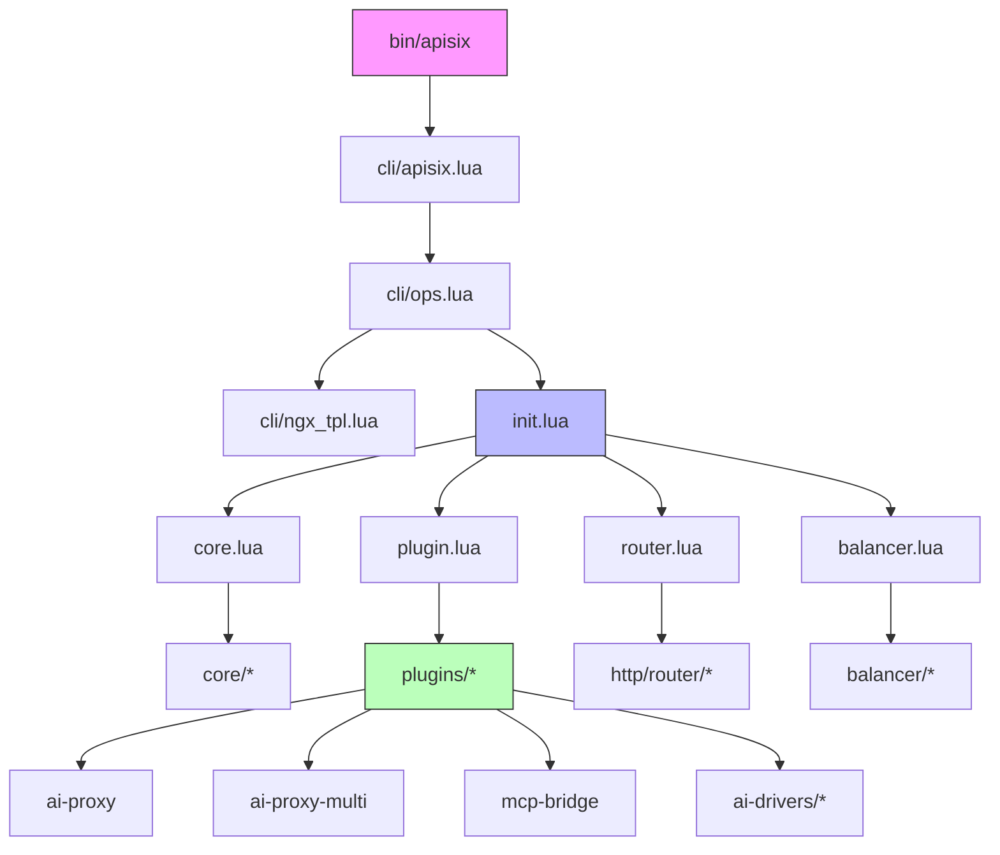
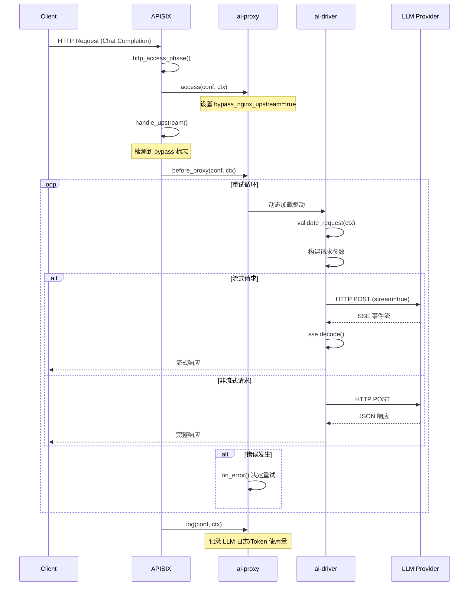
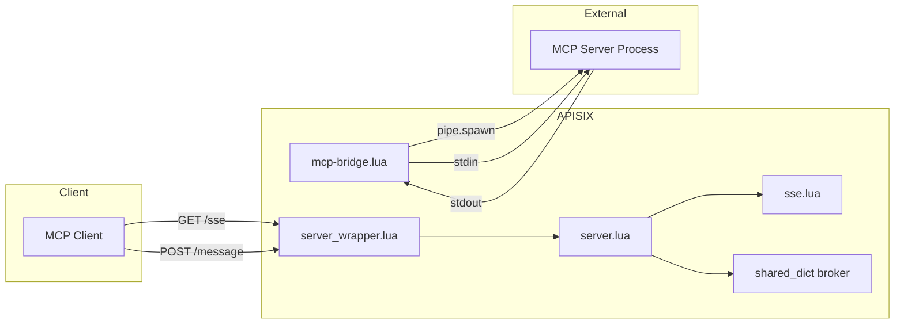
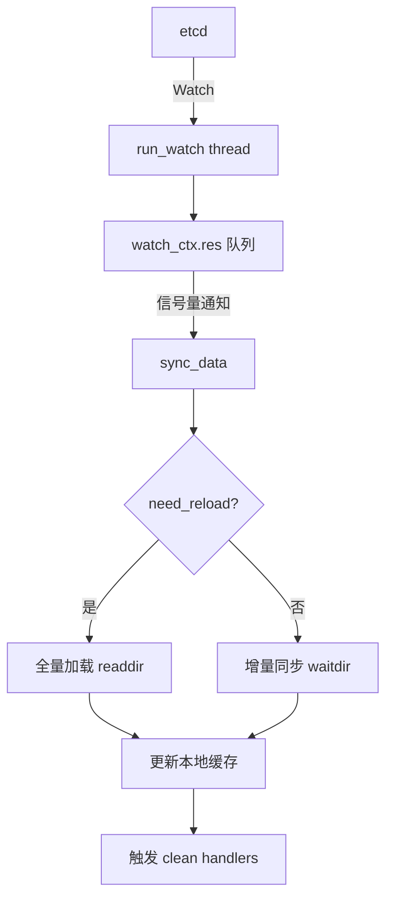

# Apache APISIX 仓库深度走读报告

> **生成日期**: 2026-02-19
> **目标读者**: 开发者（插件/扩展开发）+ 运维工程师（部署维护）
> **分析锚点**: AI Gateway 功能

---

## 目录

1. [项目概述](#1-项目概述)
2. [全局架构地图](#2-全局架构地图)
3. [AI Gateway 入口与执行流程](#3-ai-gateway-入口与执行流程)
4. [核心模块深挖](#4-核心模块深挖)
5. [上手实操指南](#5-上手实操指南)
6. [二次开发扩展点](#6-二次开发扩展点)
7. [关键文件索引](#7-关键文件索引)

---

## 1. 项目概述

**Apache APISIX** 是一个动态、实时、高性能的 API Gateway / AI Gateway，基于 OpenResty (Nginx + LuaJIT) 构建。

### 1.1 核心特性

| 特性 | 描述 |
|------|------|
| **动态配置** | 通过 Admin API 实时更新路由/上游/插件，无需重启 |
| **插件系统** | 100+ 内置插件（认证、限流、日志、AI 代理等） |
| **多协议支持** | HTTP/HTTPS、gRPC、TCP/UDP、MQTT、Dubbo、HTTP/3 |
| **AI Gateway** | LLM 代理、负载均衡、RAG 集成、MCP 协议支持 |
| **服务发现** | Nacos、Consul、Eureka、Kubernetes、DNS |

### 1.2 技术栈

```
OpenResty (Nginx + LuaJIT)
    ├── etcd (配置中心)
    ├── resty.radixtree (路由匹配)
    ├── resty.healthcheck (健康检查)
    └── resty.lrucache (本地缓存)
```

---

## 2. 全局架构地图

### 2.1 顶层目录职责

| 目录 | 职责 |
|------|------|
| `apisix/` | 核心代码目录 - 所有 Lua 模块、插件、路由逻辑 |
| `conf/` | 配置目录 - config.yaml、证书、mime.types |
| `bin/` | 入口脚本 - `apisix` 命令行启动脚本 |
| `ci/` | CI/CD 脚本 - GitHub Actions、测试运行器 |
| `t/` | 测试目录 - Perl 测试框架 (Test::Nginx) |
| `docs/` | 文档 - 多语言文档 (en/zh) |

### 2.2 apisix/ 核心目录结构

```
apisix/
├── init.lua              # 主入口 - http_init, http_init_worker, http_access_phase 等
├── core.lua              # 核心模块加载器
├── plugin.lua            # 插件系统核心
├── router.lua            # HTTP 路由器
├── balancer.lua          # 负载均衡器
├── upstream.lua          # 上游管理
│
├── core/                 # 核心工具库
│   ├── config_etcd.lua   # etcd 配置中心
│   ├── config_yaml.lua   # YAML 配置解析
│   ├── ctx.lua           # 请求上下文
│   ├── etcd.lua          # etcd 客户端
│   ├── lrucache.lua      # LRU 缓存
│   └── ...
│
├── cli/                  # 命令行工具
│   ├── apisix.lua        # CLI 入口
│   ├── ops.lua           # 操作实现
│   └── ngx_tpl.lua       # Nginx 配置模板
│
├── plugins/              # 插件目录 (122 个插件)
│   ├── ai.lua            # AI 网关优化插件
│   ├── ai-proxy.lua      # AI 代理
│   ├── ai-proxy-multi.lua # 多实例 AI 代理
│   ├── ai-rag.lua        # RAG 支持
│   ├── mcp-bridge.lua    # MCP 协议桥接
│   └── ...
│
├── admin/                # Admin API
│   ├── init.lua          # Admin API 入口
│   ├── routes.lua        # 路由管理 API
│   └── ...
│
├── discovery/            # 服务发现
│   ├── nacos/
│   ├── kubernetes/
│   ├── consul/
│   └── ...
│
├── balancer/             # 负载均衡实现
│   ├── roundrobin.lua
│   ├── chash.lua
│   ├── ewma.lua
│   └── least_conn.lua
│
└── http/router/          # 路由实现
    ├── radixtree_uri.lua
    └── radixtree_host_uri.lua
```

### 2.3 模块依赖关系



---

## 3. AI Gateway 入口与执行流程

### 3.1 AI Gateway 插件概览

| 插件 | 优先级 | 功能 |
|------|--------|------|
| `ai` | 22900 | 全局路由优化 |
| `ai-prompt-guard` | 1072 | Prompt 内容过滤 |
| `ai-prompt-template` | 1071 | 模板渲染 |
| `ai-prompt-decorator` | 1070 | 消息装饰 |
| `ai-rag` | 1060 | RAG 检索增强 |
| `ai-proxy-multi` | 1041 | 多实例负载均衡 |
| `ai-proxy` | 1040 | 单实例代理 |
| `ai-rate-limiting` | 1030 | Token 限流 |
| `mcp-bridge` | 510 | MCP 协议桥接 |

### 3.2 ai-proxy 执行链路



### 3.3 关键实现细节

#### 3.3.1 bypass_nginx_upstream 模式

```lua
-- apisix/plugins/ai-proxy.lua
function _M.access(conf, ctx)
    ctx.picked_ai_instance_name = "ai-proxy-" .. conf.provider
    ctx.picked_ai_instance = conf
    ctx.balancer_ip = ctx.picked_ai_instance_name
    ctx.bypass_nginx_upstream = true  -- 关键：绕过 Nginx 标准代理
end
```

#### 3.3.2 AI 驱动架构

```
ai-drivers/
├── openai-base.lua      # 基础驱动实现
├── openai.lua           # OpenAI (继承 openai-base)
├── azure-openai.lua     # Azure OpenAI
├── anthropic.lua        # Claude
├── gemini.lua           # Google Gemini
├── vertex-ai.lua        # Google Vertex AI (含 request_filter/response_filter)
├── deepseek.lua         # DeepSeek
├── openrouter.lua       # OpenRouter
└── openai-compatible.lua # 通用 OpenAI 兼容
```

#### 3.3.3 流式响应处理

```lua
-- apisix/plugins/ai-drivers/openai-base.lua
local function read_response(conf, ctx, res, response_filter)
    if content_type and core.string.find(content_type, "text/event-stream") then
        -- 流式响应
        while true do
            local chunk, err = body_reader()
            local events = sse.decode(chunk)
            for _, event in ipairs(events) do
                if event.type == "message" then
                    -- 提取内容并发送给客户端
                    plugin.lua_response_filter(ctx, res.headers, chunk)
                elseif event.type == "done" then
                    ctx.var.llm_request_done = true
                end
            end
        end
    end
end
```

### 3.4 MCP Bridge 实现架构



**MCP Bridge 关键设计：**

1. **双通道架构**: SSE 通道用于服务端推送，HTTP POST 用于客户端消息
2. **进程生命周期绑定**: 每个 SSE 连接对应一个独立的 MCP 进程
3. **消息队列解耦**: 使用 `ngx.shared.DICT` 实现跨请求消息传递

---

## 4. 核心模块深挖

### 4.1 插件系统

#### 4.1.1 插件加载流程

```lua
-- apisix/plugin.lua
http_init_worker()
    → plugin.init_worker()
        → plugin.load(config)
            → get_plugin_names(config)
            → load_plugin(name, plugins_list, plugin_type)
                → pcall(require, "apisix.plugins." .. name)
                → 验证 priority, version, schema
                → plugin.init()
            → 按 priority 排序
            → 存入 local_plugins_hash
```

#### 4.1.2 插件生命周期方法

| 方法 | 阶段 | 说明 |
|------|------|------|
| `init()` | 加载时 | 插件加载时调用一次 |
| `check_schema(conf, schema_type)` | 配置校验 | 验证插件配置 |
| `rewrite(conf, ctx)` | rewrite 阶段 | URI 重写等 |
| `access(conf, ctx)` | access 阶段 | 访问控制、上游选择 |
| `before_proxy(conf, ctx)` | 代理前 | 发送到上游前执行 |
| `header_filter(conf, ctx)` | header_filter | 响应头处理 |
| `body_filter(conf, ctx)` | body_filter | 响应体处理 |
| `log(conf, ctx)` | log 阶段 | 日志记录 |

#### 4.1.3 插件执行上下文

```lua
api_ctx = {
    ngx_ctx = ...,              -- Nginx 上下文
    var = ...,                  -- 变量表 (ngx.var 和自定义变量)
    matched_route = ...,        -- 匹配的路由
    matched_upstream = ...,     -- 匹配的上游
    plugins = ...,              -- 该请求要执行的插件列表
    consumer = ...,             -- 认证的消费者
    picked_server = ...,        -- 选中的服务器
    balancer_ip = ...,          -- 负载均衡 IP
    bypass_nginx_upstream = ..., -- 是否绕过 Nginx 上游
}
```

### 4.2 路由匹配

#### 4.2.1 Radixtree 实现

APISIX 使用 `resty.radixtree` 库实现 O(k) 时间复杂度的路径匹配：

```lua
-- apisix/http/router/radixtree_host_uri.lua
-- 两级 radixtree：先匹配 Host（反转），再匹配 URI

local function create_radixtree_router(routes)
    for i, host in ipairs(hosts) do
        local host_rev = host:reverse()  -- Host 反转优化前缀匹配
        -- 为每个 host 创建子路由器
        local sub_router = router.new(routes)
    end
    -- 创建 host_router
    host_router = router.new(host_router_routes)
end
```

#### 4.2.2 路由匹配优先级

1. `priority` 字段：数值越大优先级越高
2. 路径长度：更具体的路径优先
3. 匹配条件：method, host, remote_addr, vars

### 4.3 负载均衡

#### 4.3.1 支持的算法

| 算法 | 文件 | 特点 |
|------|------|------|
| roundrobin | `balancer/roundrobin.lua` | 加权轮询 |
| chash | `balancer/chash.lua` | 一致性哈希 (160 虚拟节点/服务器) |
| ewma | `balancer/ewma.lua` | 指数加权移动平均，动态评估响应时间 |
| least_conn | `balancer/least_conn.lua` | 最小连接数，使用二叉堆 |
| priority | `balancer/priority.lua` | 按优先级分组，失败后降级 |

#### 4.3.2 EWMA 算法

```lua
-- apisix/balancer/ewma.lua
local DECAY_TIME = 10  -- 衰减时间（秒）

local function decay_ewma(ewma, last_touched_at, rtt, now)
    local td = now - last_touched_at
    local weight = math.exp(-td / DECAY_TIME)
    ewma = ewma * weight + rtt * (1.0 - weight)
    return ewma
end
```

### 4.4 配置管理

#### 4.4.1 etcd 配置同步



#### 4.4.2 配置版本追踪

- `prev_index`: etcd revision (用于 watch)
- `conf_version`: 本地变更计数 (用于快速比较)
- `modifiedIndex`: 每个配置项的修改版本

### 4.5 服务发现

| 类型 | 实现文件 | 特点 |
|------|----------|------|
| Nacos | `discovery/nacos/init.lua` | 定时拉取服务列表 |
| Kubernetes | `discovery/kubernetes/init.lua` | Informer 模式 watch EndpointSlice |
| DNS | `discovery/dns/init.lua` | 实时 DNS 解析 |
| Consul | `discovery/consul/init.lua` | HTTP API 查询 |

---

## 5. 上手实操指南

### 5.1 最小依赖

```bash
# 必需组件
- OpenResty >= 1.19
- etcd >= 3.4.0 (或使用 YAML standalone 模式)
- LuaRocks (用于安装 Lua 依赖)
```

### 5.2 快速启动

```bash
# 1. 安装 OpenResty
brew install openresty/brew/openresty  # macOS
# 或参考 https://openresty.org/en/installation.html

# 2. 安装 etcd
brew install etcd
etcd &

# 3. 克隆仓库
git clone https://github.com/apache/apisix.git
cd apisix

# 4. 安装依赖
make deps

# 5. 初始化配置
cp conf/config.yaml.example conf/config.yaml

# 6. 启动 APISIX
./bin/apisix start
```

### 5.3 核心配置说明

```yaml
# conf/config.yaml

apisix:
  node_listen: 9080          # HTTP 端口
  enable_admin: true         # 启用 Admin API
  router:
    http: radixtree_host_uri # 路由匹配模式

deployment:
  role: traditional
  role_traditional:
    config_provider: etcd    # 配置提供者: etcd | yaml
  etcd:
    host:
      - http://127.0.0.1:2379
    prefix: /apisix
  admin:
    admin_key:
      - name: admin
        key: "your-secret-key"  # Admin API 密钥
        role: admin

plugins:  # 启用的插件列表
  - ai-proxy
  - ai-proxy-multi
  - ai-rate-limiting
  - mcp-bridge
  # ... 更多插件
```

### 5.4 AI Gateway 示例

#### 5.4.1 配置 AI 代理路由

```bash
# 创建路由，使用 ai-proxy 插件代理到 OpenAI
curl -X PUT http://127.0.0.1:9180/apisix/admin/routes/1 \
  -H "X-API-KEY: your-secret-key" \
  -H "Content-Type: application/json" \
  -d '{
    "uri": "/v1/chat/*",
    "plugins": {
      "ai-proxy": {
        "provider": "openai",
        "auth": {
          "header": {
            "Authorization": "Bearer sk-xxx"
          }
        }
      }
    }
  }'
```

#### 5.4.2 多实例负载均衡

```bash
# 使用 ai-proxy-multi 实现多 LLM 负载均衡
curl -X PUT http://127.0.0.1:9180/apisix/admin/routes/2 \
  -H "X-API-KEY: your-secret-key" \
  -H "Content-Type: application/json" \
  -d '{
    "uri": "/v1/chat/*",
    "plugins": {
      "ai-proxy-multi": {
        "instances": [
          {
            "name": "openai-primary",
            "provider": "openai",
            "priority": 100,
            "weight": 70,
            "auth": {"header": {"Authorization": "Bearer sk-openai"}}
          },
          {
            "name": "deepseek-backup",
            "provider": "deepseek",
            "priority": 50,
            "weight": 30,
            "auth": {"header": {"Authorization": "Bearer sk-deepseek"}}
          }
        ],
        "balancer": {
          "algorithm": "roundrobin"
        },
        "fallback_strategy": ["http_429", "http_5xx"]
      }
    }
  }'
```

### 5.5 常见问题排查

| 问题 | 可能原因 | 解决方案 |
|------|----------|----------|
| 启动失败 | etcd 未运行 | 检查 etcd 状态：`etcdctl endpoint health` |
| 路由不生效 | Admin API key 错误 | 检查 config.yaml 中的 admin_key |
| AI 请求超时 | 上游 LLM 服务慢 | 调整 timeout 配置或检查网络 |
| 流式响应中断 | Nginx 缓冲 | 确认 `proxy_buffering off` |
| 配置不同步 | etcd watch 失败 | 检查 etcd 连接和日志 |

---

## 6. 二次开发扩展点

### 6.1 开发自定义插件

#### 6.1.1 插件目录结构

```
/path/to/custom/
└── apisix/
    └── plugins/
        └── my-plugin.lua
```

#### 6.1.2 插件模板

```lua
-- my-plugin.lua
local plugin_name = "my-plugin"

local schema = {
    type = "object",
    properties = {
        message = { type = "string" },
    },
    required = {"message"},
}

local _M = {
    version = 0.1,
    priority = 100,  -- 优先级（建议 1-99）
    name = plugin_name,
    schema = schema,
}

function _M.check_schema(conf, schema_type)
    return core.schema.check(schema, conf)
end

function _M.access(conf, ctx)
    core.log.info("my-plugin: ", conf.message)
    -- 插件逻辑
end

return _M
```

#### 6.1.3 加载自定义插件

```yaml
# conf/config.yaml
apisix:
  extra_lua_path: "/path/to/custom/?.lua"

plugins:
  - my-plugin  # 添加自定义插件
```

### 6.2 开发 AI 驱动

#### 6.2.1 继承 openai-base

```lua
-- apisix/plugins/ai-drivers/my-provider.lua
return require("apisix.plugins.ai-drivers.openai-base").new({
    host = "api.my-provider.com",
    path = "/v1/chat/completions",
    port = 443,
})
```

#### 6.2.2 自定义请求/响应处理

```lua
-- 类似 vertex-ai.lua 的实现
local _M = {}

function _M.new(opt)
    return setmetatable(opt, { __index = _M })
end

function _M.request_filter(conf, ctx, params)
    -- 转换请求格式
end

function _M.response_filter(conf, ctx, response)
    -- 转换响应格式
end

return _M
```

### 6.3 扩展服务发现

```lua
-- apisix/discovery/my-discovery/init.lua
local _M = {}

function _M.init_worker()
    -- 初始化逻辑
end

function _M.nodes(service_name, discovery_args)
    -- 返回节点列表
    return {
        { host = "10.0.0.1", port = 8080, weight = 100 },
        { host = "10.0.0.2", port = 8080, weight = 100 },
    }
end

return _M
```

### 6.4 编写测试用例

```perl
# t/plugin/my-plugin.t
use t::APISIX 'no_plan';

run_tests;

__DATA__

=== TEST 1: enable plugin
--- config
    location /t {
        content_by_lua_block {
            local t = require("lib.test_admin").test
            local code, message = t('/apisix/admin/routes/1',
                ngx.HTTP_PUT,
                [[{
                    "uri": "/hello",
                    "plugins": {
                        "my-plugin": {
                            "message": "test"
                        }
                    },
                    "upstream": {
                        "nodes": { "127.0.0.1:1980": 1 }
                    }
                }]]
            )
            ngx.say(message)
        }
    }
--- request
GET /t
--- response_body
passed
```

---

## 7. 关键文件索引

### 7.1 入口与初始化

| 文件 | 说明 |
|------|------|
| `bin/apisix` | 启动脚本入口 |
| `apisix/cli/apisix.lua` | CLI 入口 |
| `apisix/cli/ngx_tpl.lua` | Nginx 配置模板 |
| `apisix/init.lua` | 主入口 - 各阶段处理函数 |

### 7.2 核心模块

| 文件 | 说明 |
|------|------|
| `apisix/core.lua` | 核心模块加载器 |
| `apisix/plugin.lua` | 插件系统 |
| `apisix/router.lua` | 路由入口 |
| `apisix/balancer.lua` | 负载均衡入口 |
| `apisix/upstream.lua` | 上游管理 |

### 7.3 AI Gateway

| 文件 | 说明 |
|------|------|
| `apisix/plugins/ai-proxy.lua` | 单实例 AI 代理 |
| `apisix/plugins/ai-proxy-multi.lua` | 多实例负载均衡 |
| `apisix/plugins/ai-proxy/base.lua` | AI 代理核心逻辑 |
| `apisix/plugins/ai-drivers/openai-base.lua` | AI 驱动基类 |
| `apisix/plugins/mcp-bridge.lua` | MCP 协议桥接 |

### 7.4 配置与存储

| 文件 | 说明 |
|------|------|
| `apisix/core/config_etcd.lua` | etcd 配置提供者 |
| `apisix/core/config_yaml.lua` | YAML 配置提供者 |
| `apisix/core/etcd.lua` | etcd 客户端封装 |
| `apisix/admin/init.lua` | Admin API 入口 |

### 7.5 配置文件

| 文件 | 说明 |
|------|------|
| `conf/config.yaml` | 主配置文件 |
| `conf/config.yaml.example` | 配置示例 |
| `conf/apisix.yaml` | Standalone 模式配置 |

---

## 附录：架构设计洞察

### A. bypass_nginx_upstream 模式

APISIX 通过设置 `ctx.bypass_nginx_upstream = true` 绕过 Nginx 标准代理，完全由 Lua HTTP 客户端处理请求。这种设计允许：
- 精细的流式响应控制
- 自定义重试和错误处理逻辑
- 与 AI 服务商的特殊协议适配

### B. 单 Watcher 多消费者

配置同步采用单 Watcher 多消费者模式：
- 一个主 watcher 监听所有 etcd 变更
- 多个 per-key 消费者通过信号量等待
- 减少 etcd 连接数，提高效率

### C. Host 反转优化

路由匹配时将 Host 字符串反转后构建 radixtree：
- 优化多租户场景的域名匹配
- 支持通配符域名的有效前缀匹配

### D. 插件优先级与执行顺序

插件按 `priority` 降序执行，但可以通过 `_meta.priority` 在运行时覆盖。这种设计允许：
- 相同插件在不同路由上使用不同优先级
- 动态调整插件执行顺序

---

*报告生成于 2026-02-19*
