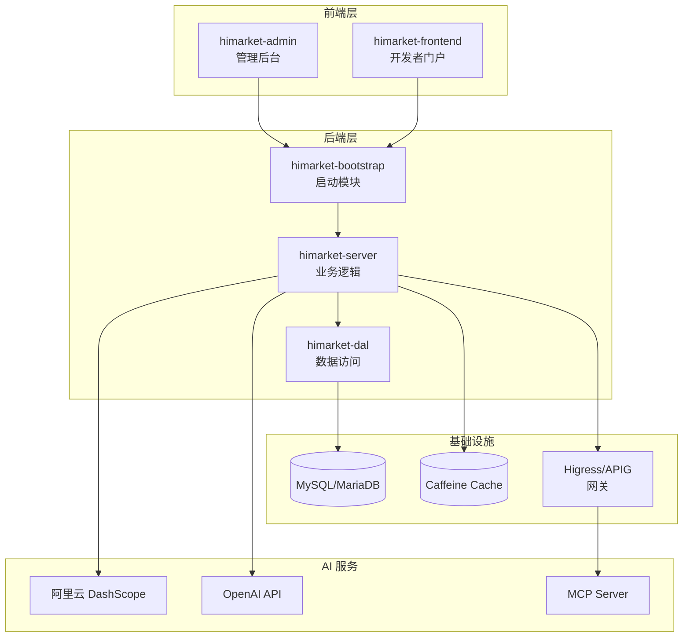
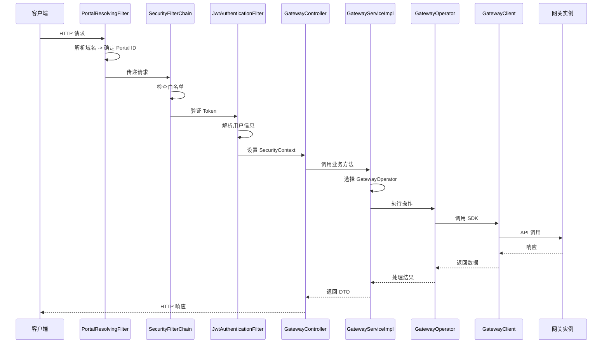
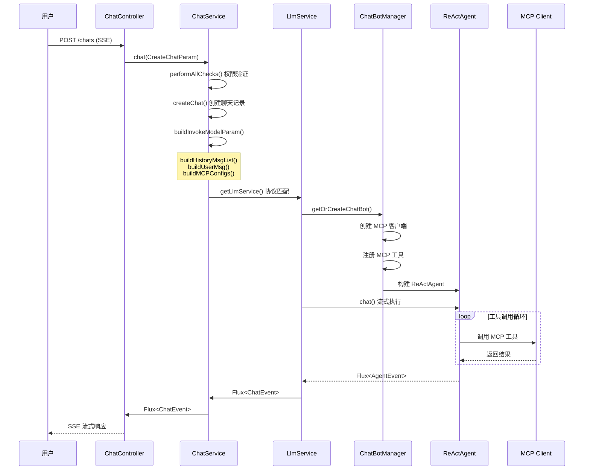
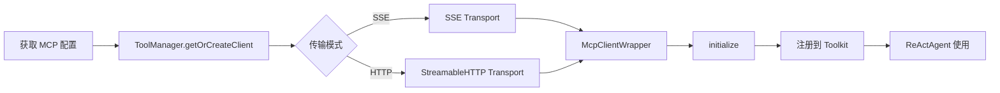
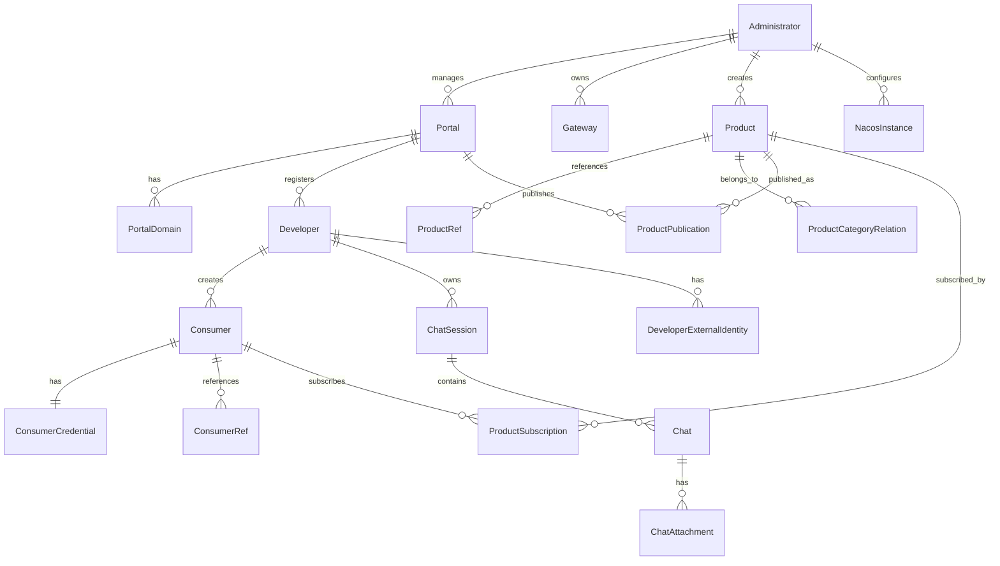

# HiMarket 仓库深度走读报告

> **生成日期**: 2026-02-18
> **仓库**: higress-group/himarket
> **版本**: main branch (commit: 9778638)
> **报告类型**: 完整深度走读 + 评分 + 改进建议

---

## 目录

1. [执行摘要](#执行摘要)
2. [Phase 1: 全局架构地图](#phase-1-全局架构地图)
3. [Phase 2: 入口与执行流程](#phase-2-入口与执行流程)
4. [Phase 3: 核心模块深挖](#phase-3-核心模块深挖)
5. [Phase 4: 上手实操与二次开发](#phase-4-上手实操与二次开发)
6. [Phase 5: 仓库文档总结](#phase-5-仓库文档总结)
7. [Phase 6: 评分与改进建议](#phase-6-评分与改进建议)
8. [附录](#附录)

---

## 执行摘要

### 项目定位

**HiMarket** 是基于 Higress AI 网关构建的**企业级 AI 开放平台**，旨在帮助企业构建私有 AI 能力市场，统一管理和分发 LLM、MCP Server、Agent 等 AI 资源。

### 核心价值

| 维度 | 描述 |
|------|------|
| **资源管理** | 统一管理 MCP Server、Model、Agent 等 AI 资源 |
| **产品化封装** | 将分散的 AI 能力封装为标准化的 API 产品 |
| **开发者门户** | 提供自助式开发者门户，支持订阅和调用 |
| **企业级能力** | 安全管控、观测分析、计量计费 |

### 技术栈概览

```
┌─────────────────────────────────────────────────────────────┐
│                      技术栈全景                              │
├─────────────────────────────────────────────────────────────┤
│  后端: Java 17 + Spring Boot 3.2 + Spring Data JPA + Flyway │
│  前端: React 19 + TypeScript 5 + Ant Design 6 + Vite 6     │
│  数据库: MySQL 8.0+ / MariaDB                               │
│  缓存: Caffeine (本地缓存)                                   │
│  AI框架: AgentScope 1.0.6 + DashScope SDK + OpenAI SDK     │
│  网关集成: Higress + 阿里云 APIG + ADP AI Gateway           │
│  部署: Docker Compose / Kubernetes Helm                     │
│  CI/CD: GitHub Actions                                      │
└─────────────────────────────────────────────────────────────┘
```

---

## Phase 1: 全局架构地图

### 1.1 顶层目录结构

```
/Volumes/work/workspace/himarket/
├── .github/                    # GitHub 配置（CI/CD、Issue/PR 模板）
├── .husky/                     # Git hooks（pre-commit）
├── .mvn/                       # Maven wrapper 配置
├── deploy/                     # 部署配置
│   ├── docker/                 # Docker Compose 部署脚本
│   └── helm/                   # Kubernetes Helm Chart 部署
├── himarket-bootstrap/         # 应用启动模块（Spring Boot 入口）
├── himarket-dal/               # 数据访问层（Entity、Repository、Converter）
├── himarket-server/            # 业务逻辑层（Controller、Service、DTO、Core）
├── himarket-web/               # 前端应用
│   ├── himarket-admin/         # 管理后台前端
│   └── himarket-frontend/      # 开发者门户前端
├── pom.xml                     # Maven 父 POM
└── docs/                       # 文档目录
```

### 1.2 模块职责划分

| 模块 | 职责 | 核心包 |
|------|------|--------|
| **himarket-bootstrap** | 应用启动入口、全局配置、过滤器 | `config/`, `filter/`, `HiMarketApplication.java` |
| **himarket-dal** | 数据访问层、实体定义、Repository | `entity/`, `repository/`, `converter/`, `support/` |
| **himarket-server** | 业务逻辑层、API 控制器、服务实现 | `controller/`, `service/`, `dto/`, `core/` |
| **himarket-admin** | 管理后台前端 (React) | 管理员操作界面 |
| **himarket-frontend** | 开发者门户前端 (React) | 开发者自助服务界面 |

### 1.3 模块依赖关系图



### 1.4 装配点与入口点

| 类型 | 位置 | 关键类/配置 |
|------|------|-------------|
| **应用入口** | `himarket-bootstrap/.../HiMarketApplication.java:26` | `@SpringBootApplication` |
| **安全配置** | `himarket-bootstrap/.../config/SecurityConfig.java:43` | JWT 认证 + 白名单 |
| **数据库迁移** | `himarket-bootstrap/.../resources/db/migration/` | Flyway V1-V6 |
| **API 文档** | `himarket-bootstrap/.../config/SwaggerConfig.java` | OpenAPI 3.0 |
| **过滤器链** | `himarket-bootstrap/.../filter/PortalResolvingFilter.java:38` | 门户域名解析 |

### 1.5 API 路由概览

| 路由前缀 | 控制器 | 用途 |
|----------|--------|------|
| `/gateways` | GatewayController | 网关实例管理 |
| `/products` | ProductController | API 产品管理 |
| `/developers` | DeveloperController | 开发者管理 |
| `/consumers` | ConsumerController | 消费者凭证管理 |
| `/portals` | PortalController | 门户管理 |
| `/chats` | ChatController | AI 聊天服务 (SSE) |
| `/sessions` | SessionController | 聊天会话管理 |
| `/admins` | AdministratorController | 管理员管理 |

---

## Phase 2: 入口与执行流程

### 2.1 网关服务请求流程



### 2.2 AI 聊天服务执行流程



### 2.3 关键入口点定位

#### 2.3.1 Spring Boot 主入口

**文件**: `himarket-bootstrap/src/main/java/com/alibaba/himarket/HiMarketApplication.java:26-33`

```java
@SpringBootApplication
@EnableJpaAuditing
public class HiMarketApplication {
    public static void main(String[] args) {
        SpringApplication.run(HiMarketApplication.class, args);
    }
}
```

#### 2.3.2 网关服务入口

**服务接口**: `himarket-server/src/main/java/com/alibaba/himarket/service/GatewayService.java:38-138`

**服务实现**: `himarket-server/src/main/java/com/alibaba/himarket/service/impl/GatewayServiceImpl.java:65-386`

#### 2.3.3 聊天服务入口

**控制器**: `himarket-server/src/main/java/com/alibaba/himarket/controller/ChatController.java:43-68`

**服务实现**: `himarket-server/src/main/java/com/alibaba/himarket/service/hichat/service/ChatService.java:65-66`

---

## Phase 3: 核心模块深挖

### 3.1 网关操作器系统 (Gateway Operator System)

#### 概念

网关操作器是 HiMarket 与底层网关（Higress、APIG 等）交互的抽象层，采用**策略模式 + 工厂模式**实现多网关类型的统一管理。

#### 代码定位

| 组件 | 文件路径 | 行号 |
|------|----------|------|
| 抽象基类 | `himarket-server/.../service/gateway/GatewayOperator.java` | 30-150 |
| APIG 实现 | `himarket-server/.../service/gateway/APIGOperator.java` | 35-400 |
| Higress 实现 | `himarket-server/.../service/gateway/HigressOperator.java` | 30-350 |

#### 核心数据结构

```java
// 网关类型枚举
public enum GatewayType {
    APIG_API("API"),           // 原生 API 网关
    APIG_AI("AI"),             // AI 网关
    ADP_AI_GATEWAY,            // ADP AI 网关
    APSARA_GATEWAY,            // Apsara AI 网关
    HIGRESS("Higress");        // Higress 网关
}

// 网关实体
@Entity
@Table(name = "gateway")
public class Gateway extends BaseEntity {
    private GatewayType gatewayType;
    private APIGConfig apigConfig;       // JSON
    private HigressConfig higressConfig; // JSON
    // ...
}
```

#### 关键流程

```
1. 管理员导入网关 -> GatewayController.importGateway()
2. 服务层选择操作器 -> GatewayServiceImpl.selectOperator(gatewayType)
3. 操作器执行操作 -> operator.fetchMcpServers() / fetchModelAPIs()
4. 结果封装返回 -> PageResult<APIResult>
```

#### 扩展点

新增网关类型需要：
1. 在 `GatewayType` 枚举添加新类型
2. 创建 `NewGatewayConfig` 配置类
3. 实现 `GatewayOperator` 抽象类
4. Spring 自动发现并注册

### 3.2 LLM 服务适配层

#### 概念

LLM 服务适配层负责与不同 AI 模型提供商（DashScope、OpenAI 等）的集成，支持流式响应和工具调用。

#### 代码定位

| 组件 | 文件路径 | 行号 |
|------|----------|------|
| 服务接口 | `himarket-server/.../service/hichat/service/LlmService.java` | 30-55 |
| 抽象基类 | `himarket-server/.../service/hichat/service/AbstractLlmService.java` | 47-296 |
| DashScope 实现 | `himarket-server/.../service/hichat/service/DashScopeLlmService.java` | 39-91 |
| OpenAI 实现 | `himarket-server/.../service/hichat/service/OpenAILlmService.java` | 25-100 |

#### 核心数据结构

```java
// AI 协议枚举
public enum AIProtocol {
    OPENAI("OpenAI/V1"),
    ANTHROPIC("Anthropic"),
    DASHSCOPE("DashScope"),
    DASHSCOPE_IMAGE("DashScopeImage");
}

// 聊天事件类型
public enum EventType {
    START,        // 流开始
    ASSISTANT,    // 助手响应文本
    THINKING,     // 思考/推理过程
    TOOL_CALL,    // 工具调用
    TOOL_RESULT,  // 工具执行结果
    DONE,         // 流结束
    ERROR         // 错误
}
```

#### 关键流程

```
1. 请求参数构建 -> ChatService.buildInvokeModelParam()
2. 协议匹配 -> getLlmService().match(protocol)
3. 模型创建 -> AbstractLlmService.newChatModel() [抽象方法]
4. ChatBot 获取 -> ChatBotManager.getOrCreateChatBot()
5. 流式执行 -> ChatBot.chat() -> Flux<ChatEvent>
```

### 3.3 MCP 工具管理系统

#### 概念

MCP (Model Context Protocol) 工具管理系统负责与 MCP Server 的连接、工具注册和调用。

#### 代码定位

| 组件 | 文件路径 | 行号 |
|------|----------|------|
| 工具管理器 | `himarket-server/.../service/hichat/manager/ToolManager.java` | 49-318 |
| ChatBot 管理器 | `himarket-server/.../service/hichat/manager/ChatBotManager.java` | 59-520 |
| ChatBot 实体 | `himarket-server/.../service/hichat/support/ChatBot.java` | 19-86 |

#### 核心数据结构

```java
// MCP 传输配置
@Data
@Builder
public class MCPTransportConfig {
    private String mcpServerName;
    private MCPTransportMode transportMode;  // SSE / STREAMABLE_HTTP
    private String url;
    private Map<String, String> headers;     // 认证头
    private Map<String, String> queryParams; // 查询参数
}

// 传输模式
public enum MCPTransportMode {
    STDIO("stdio"),
    SSE("sse"),
    STREAMABLE_HTTP("StreamableHTTP");
}
```

#### 关键流程



### 3.4 数据模型与存储层

#### 概念

使用 Spring Data JPA 实现数据持久化，Flyway 管理数据库迁移，大量使用 JSON 字段存储复杂配置。

#### 核心实体关系



#### JSON 字段使用

| 实体 | JSON 字段 | 用途 |
|------|-----------|------|
| Product | icon, feature, document | 产品图标、特性、文档 |
| Gateway | apigConfig, higressConfig | 网关配置 |
| ConsumerCredential | apikeyConfig, hmacConfig, jwtConfig | 认证配置 |
| Chat | attachments, chatUsage, toolCalls | 聊天元数据 |

---

## Phase 4: 上手实操与二次开发

### 4.1 环境依赖

| 依赖 | 版本要求 | 用途 |
|------|----------|------|
| JDK | 17+ | 后端运行时 |
| Node.js | 18+ | 前端构建 |
| Maven | 3.6+ | 后端构建 |
| MySQL | 8.0+ / MariaDB | 数据库 |

### 4.2 快速启动

#### 方式一：本地开发环境

```bash
# 1. 构建后端
mvn clean package -DskipTests

# 2. 启动后端服务
java --add-opens java.base/java.util=ALL-UNNAMED \
     --add-opens java.base/java.lang=ALL-UNNAMED \
     -Ddb.host=${DB_HOST} \
     -Ddb.port=${DB_PORT} \
     -Ddb.name=${DB_NAME} \
     -Ddb.username=${DB_USERNAME} \
     -Ddb.password=${DB_PASSWORD} \
     -jar himarket-bootstrap/target/himarket-bootstrap-1.0-SNAPSHOT.jar

# 3. 启动管理后台前端
cd himarket-web/himarket-admin
npm install && npm run dev
# 访问: http://localhost:5174

# 4. 启动开发者门户前端
cd himarket-web/himarket-frontend
npm install && npm run dev
# 访问: http://localhost:5173
```

#### 方式二：Docker Compose

```bash
cd deploy/docker/scripts
./deploy.sh install
# 管理后台: http://localhost:5174
# 开发者门户: http://localhost:5173
# 后端 API: http://localhost:8081
```

### 4.3 必要配置项

| 配置项 | 环境变量 | 说明 |
|--------|----------|------|
| 数据库地址 | `db.host` | MySQL/MariaDB 主机 |
| 数据库端口 | `db.port` | 默认 3306 |
| 数据库名 | `db.name` | 数据库名称 |
| 数据库用户 | `db.username` | 用户名 |
| 数据库密码 | `db.password` | 密码 |

### 4.4 扩展开发指南

#### 新增网关类型

```java
// 1. 在 GatewayType 枚举中添加
public enum GatewayType {
    // 现有类型...
    NEW_GATEWAY("NewGateway");
}

// 2. 创建配置类
@Data
public class NewGatewayConfig {
    private String endpoint;
    private String apiKey;
}

// 3. 实现 GatewayOperator
@Service
public class NewGatewayOperator extends GatewayOperator<NewGatewayClient> {

    @Override
    public GatewayType getGatewayType() {
        return GatewayType.NEW_GATEWAY;
    }

    @Override
    public PageResult<APIResult> fetchRESTAPIs(Gateway gateway, int page, int size) {
        // 实现具体的 API 获取逻辑
    }

    // 实现其他抽象方法...
}
```

#### 新增 LLM 服务提供商

```java
// 1. 在 AIProtocol 枚举中添加
public enum AIProtocol {
    // 现有协议...
    NEW_LLM("NewLLM/v1");
}

// 2. 实现 LlmService
@Service
public class NewLLMService extends AbstractLlmService {

    public NewLLMService(GatewayService gatewayService, ChatBotManager chatBotManager) {
        super(gatewayService, chatBotManager);
    }

    @Override
    public Model newChatModel(LlmChatRequest request) {
        return NewLLMModel.builder()
            .apiKey(request.getApiKey())
            .baseUrl(request.getUri().toString())
            .build();
    }

    @Override
    public List<AIProtocol> getProtocols() {
        return List.of(AIProtocol.NEW_LLM);
    }
}
```

#### 新增 MCP 传输模式

```java
// 1. 在 MCPTransportMode 枚举中添加
public enum MCPTransportMode {
    // 现有模式...
    WEBSOCKET("websocket");
}

// 2. 更新 ToolManager.createClient()
switch (config.getTransportMode()) {
    case SSE:
        builder.sseTransport(config.getUrl());
        break;
    case STREAMABLE_HTTP:
        builder.streamableHttpTransport(config.getUrl());
        break;
    case WEBSOCKET:
        builder.websocketTransport(config.getUrl());
        break;
}
```

### 4.5 常见问题排查

| 问题 | 可能原因 | 解决方案 |
|------|----------|----------|
| 数据库连接失败 | 配置错误/网络问题 | 检查 db.* 配置项 |
| JWT Token 无效 | Token 过期/被撤销 | 检查 Token 有效期配置 |
| MCP 工具调用失败 | 网络超时/认证失败 | 检查 MCP Server 配置 |
| SSE 流中断 | 超时设置过短 | 调整 SseEmitter 超时配置 |
| Flyway 迁移失败 | 版本冲突 | 检查迁移脚本版本号 |

---

## Phase 5: 仓库文档总结

### 5.1 现有文档结构

| 文档 | 路径 | 内容 |
|------|------|------|
| README | `/README_zh.md` | 项目介绍、架构说明、快速开始 |
| 用户指南 | `/USER_GUIDE_zh.md` | 管理后台和开发者门户使用教程 |
| 贡献指南 | `/CONTRIBUTING_zh.md` | 开发流程、代码规范、PR 规范 |
| Docker 部署 | `/deploy/docker/Docker部署脚本说明.md` | Docker Compose 部署指南 |
| Helm 部署 | `/deploy/helm/Helm部署脚本说明.md` | Kubernetes 部署指南 |

### 5.2 API 使用规范

#### 认证方式

- **管理员**: `@AdminAuth` -> `hasRole('ADMIN')`
- **开发者**: `@DeveloperAuth` -> `hasRole('DEVELOPER')`
- **混合**: `@AdminOrDeveloperAuth`

#### 请求格式

```json
// POST /products
{
  "name": "产品名称",
  "type": "MODEL_API",
  "description": "产品描述",
  "categoryId": "分类ID"
}
```

#### 响应格式

```json
// 成功响应
{
  "code": 200,
  "message": "success",
  "data": { ... }
}

// 错误响应
{
  "code": 40001,
  "message": "Business error message",
  "data": null
}
```

### 5.3 鼓励/禁止的模式

#### 鼓励

- 使用 Spring 自动注入（`@RequiredArgsConstructor`）
- 遵循 Conventional Commits 规范
- 提交前运行 `mvn spotless:apply`
- 使用 Flyway 管理数据库变更
- 使用 JPA AttributeConverter 处理 JSON 字段

#### 禁止

- 硬编码敏感信息（密钥、密码）
- 跳过代码格式化检查
- 直接修改生产数据库
- 在 DTO 中暴露实体类

---

## Phase 6: 评分与改进建议

### 6.1 评分维度 (100 分制)

| 维度 | 分数 | 依据 |
|------|------|------|
| **架构设计** | 85/100 | 分层清晰、策略模式应用得当、扩展性强 |
| **代码质量** | 75/100 | 代码格式统一、但缺少单元测试 |
| **文档完整性** | 80/100 | 用户文档完善、API 文档齐全、缺少架构文档 |
| **可扩展性** | 90/100 | 网关/LLM/MCP 扩展点设计优秀 |
| **安全性** | 80/100 | JWT 认证、敏感数据加密、白名单机制 |
| **可观测性** | 70/100 | 基础日志、缺少分布式追踪和监控集成 |
| **测试覆盖** | 40/100 | **严重不足**，无单元测试文件 |
| **部署友好度** | 85/100 | Docker/Helm 部署脚本完善 |

### 6.2 总分

```
总分: 75.6 / 100
```

### 6.3 Top 改进建议

#### 高优先级

| # | 建议 | 影响 | 成本 |
|---|------|------|------|
| 1 | **添加单元测试** | 高 | 中 |
| 2 | **增加集成测试** | 高 | 中 |
| 3 | **添加 API 契约测试** | 中 | 低 |

**详细说明**:

```bash
# 建议的测试目录结构
himarket-server/src/test/java/
├── unit/                    # 单元测试
│   ├── service/
│   └── controller/
├── integration/             # 集成测试
│   └── api/
└── contract/                # 契约测试
    └── openapi/
```

#### 中优先级

| # | 建议 | 影响 | 成本 |
|---|------|------|------|
| 4 | 添加分布式追踪 (OpenTelemetry) | 中 | 中 |
| 5 | 完善 API 错误码文档 | 中 | 低 |
| 6 | 添加健康检查端点详情 | 低 | 低 |

#### 低优先级

| # | 建议 | 影响 | 成本 |
|---|------|------|------|
| 7 | 生成架构决策记录 (ADR) | 低 | 低 |
| 8 | 添加性能基准测试 | 低 | 高 |

### 6.4 技术债务评估

| 类型 | 描述 | 风险等级 |
|------|------|----------|
| 测试缺失 | 无自动化测试覆盖 | **高** |
| 缓存一致性 | 本地缓存不支持分布式 | 中 |
| 日志规范 | 缺少结构化日志 | 低 |

---

## 附录

### A. 关键文件路径速查

| 类别 | 文件路径 |
|------|----------|
| **主入口** | `himarket-bootstrap/src/main/java/com/alibaba/himarket/HiMarketApplication.java` |
| **安全配置** | `himarket-bootstrap/src/main/java/com/alibaba/himarket/config/SecurityConfig.java` |
| **网关服务** | `himarket-server/src/main/java/com/alibaba/himarket/service/impl/GatewayServiceImpl.java` |
| **聊天服务** | `himarket-server/src/main/java/com/alibaba/himarket/service/hichat/service/ChatService.java` |
| **LLM 抽象** | `himarket-server/src/main/java/com/alibaba/himarket/service/hichat/service/AbstractLlmService.java` |
| **网关操作器** | `himarket-server/src/main/java/com/alibaba/himarket/service/gateway/GatewayOperator.java` |
| **实体定义** | `himarket-dal/src/main/java/com/alibaba/himarket/entity/` |
| **数据库迁移** | `himarket-bootstrap/src/main/resources/db/migration/` |

### B. 依赖版本清单

| 依赖 | 版本 |
|------|------|
| Spring Boot | 3.2.11 |
| Java | 17 |
| AgentScope | 1.0.6 |
| DashScope SDK | 2.22.4 |
| OpenAI Java | 4.6.1 |
| React | 19.0.0 |
| Ant Design | 6.0.1 |
| Vite | 6.4.x |

### C. 相关链接

- [项目仓库](https://github.com/higress-group/himarket)
- [用户指南](./USER_GUIDE_zh.md)
- [贡献指南](./CONTRIBUTING_zh.md)
- [Higress 官网](https://higress.io/)

---

> **报告生成工具**: Claude Code + repo-deep-dive-report skill
> **分析深度**: Full (6 Phases)
> **图表引擎**: Mermaid
